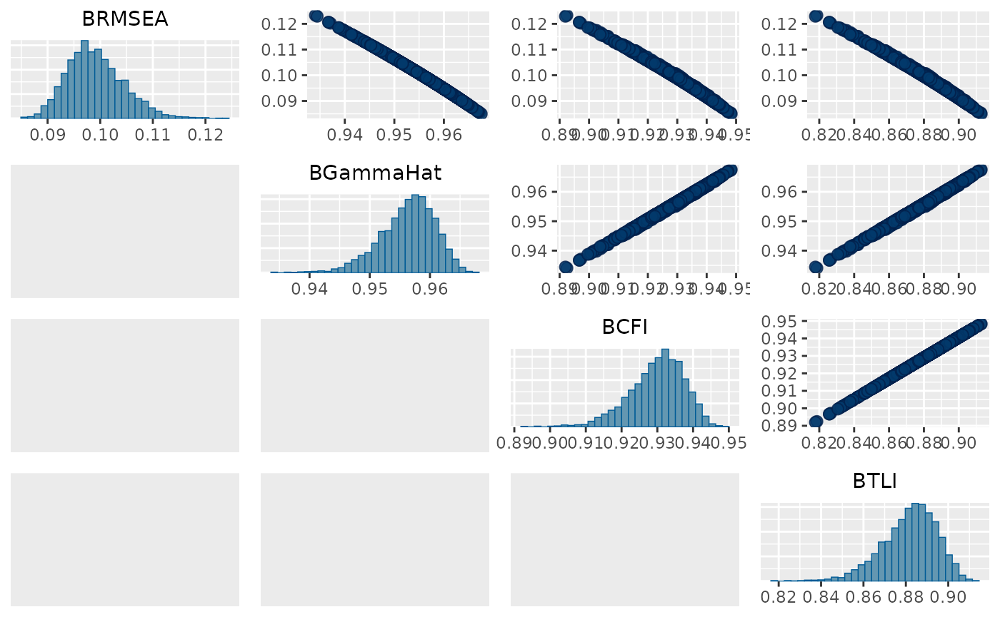

# Approximate fit indices

### Introduction

In SEM, one of the first steps is to evaluate the model’s global fit.
This is commonly done by presenting multiple fit indices, with some of
the most common being based on the model’s $\chi^{2}$. We have developed
Bayesian versions of these indices (Garnier-Villarreal and Jorgensen
2020) that can be computed with *blavaan*.

### Noncentrality-Based Fit Indices

This group of indices compares the hypothesized model against the
perfect saturated model. It specifically uses the noncentrality
parameter $\widehat{\lambda} = \chi^{2} - df$, with the df being
adjusted by different model/data characterictics. Specific indices
include Root Mean Square Error of approximation (RMSEA), McDonald’s
centrality index (Mc), gamma-hat ($\widehat{\Gamma}$), and adjusted
gamma-hat (${\widehat{\Gamma}}_{adj}$).

We will show an example with the Holzinger and Swineford (1939) example.
You first estimate your SEM/CFA model as usual

``` r
HS.model <- ' visual  =~ x1 + x2 + x3
              textual =~ x4 + x5 + x6
              speed   =~ x7 + x8 + x9 '

fit <- bcfa(HS.model, data=HolzingerSwineford1939, std.lv=TRUE)
```

You then need to pass the model to the
[`blavFitIndices()`](http://ecmerkle.github.io/blavaan/reference/blavFitIndices.md)
function

``` r
gl_fits <- blavFitIndices(fit)
```

Finally, you can describe the posterior distribution for each of the
indices with their [`summary()`](https://rdrr.io/r/base/summary.html)
function. With this call, we see the 3 central tendency measures (mean
median, and mode), the standard deviation, and the 90% Credible Interval

``` r
summary(gl_fits, central.tendency = c("mean","median","mode"), prob = .90)
```

    ## 
    ## Posterior summary statistics and highest posterior density (HPD)
    ##  90% credible intervals for devm-based fit indices:
    ## 
    ##                EAP Median   MAP    SD lower upper
    ## BRMSEA       0.099  0.099 0.097 0.005 0.090 0.107
    ## BGammaHat    0.956  0.957 0.958 0.005 0.949 0.964
    ## adjBGammaHat 0.906  0.907 0.909 0.010 0.891 0.922
    ## BMc          0.902  0.903 0.906 0.010 0.887 0.919

### Incremental Fit Indices

Another group of fit indices compares the hypothesized model with the
*worst* possible model, so they are called incremental indices. Such
indices compare your model’s $\chi_{H}^{2}$ to the *null* model’s
$\chi_{0}^{2}$ in different ways. Indices include the Comparative Fit
Index (CFI), Tucker-Lewis Index (TLI), and Normed Fit Index (NFI).

To estimate these indices we need to define and estimate the respective
*null* model. The standard *null* model used by default in frequentist
SEM programs (like *lavaan*) includes only the indicators variances and
intercepts, and no covariances between items.

You can specify your *null* model by including only the respective
indicator variances in your model syntax, such as

``` r
HS.model_null <- '
x1 ~~ x1 
x2 ~~ x2 
x3 ~~ x3
x4 ~~ x4
x5 ~~ x5
x6 ~~ x6
x7 ~~ x7
x8 ~~ x8
x9 ~~ x9 '

fit_null <- bcfa(HS.model_null, data=HolzingerSwineford1939)
```

Once you have your hypothesized and null models, you pass both to the
`blavFitIndices` function, and now it will provide both types of fit
indices

``` r
gl_fits_all <- blavFitIndices(fit, baseline.model = fit_null)

summary(gl_fits_all, central.tendency = c("mean","median","mode"), prob = .90)
```

    ## 
    ## Posterior summary statistics and highest posterior density (HPD)
    ##  90% credible intervals for devm-based fit indices:
    ## 
    ##                EAP Median   MAP    SD lower upper
    ## BRMSEA       0.099  0.099 0.097 0.005 0.090 0.107
    ## BGammaHat    0.956  0.957 0.958 0.005 0.949 0.964
    ## adjBGammaHat 0.906  0.907 0.909 0.010 0.891 0.922
    ## BMc          0.902  0.903 0.906 0.010 0.887 0.919
    ## BCFI         0.930  0.931 0.932 0.008 0.918 0.943
    ## BTLI         0.882  0.883 0.885 0.013 0.862 0.903
    ## BNFI         0.910  0.911 0.912 0.007 0.899 0.922

The [`summary()`](https://rdrr.io/r/base/summary.html) method now
presents the central tendency measure you asked for, standard deviation,
and credible interval for the noncentrality and incremental fit indices.

### Access the indices posterior distributions

You can also extract the posterior distributions for the respective
indices, this way you can explore further details. For example,
diagnostic plots using the `bayesplot` package.

``` r
dist_fits <- data.frame(gl_fits_all@indices)
head(dist_fits)
```

    ##       BRMSEA BGammaHat adjBGammaHat       BMc      BCFI      BTLI      BNFI
    ## 1 0.10558430 0.9507858    0.8940060 0.8900625 0.9201415 0.8653067 0.9003429
    ## 2 0.09748425 0.9577404    0.9089842 0.9054895 0.9319868 0.8852855 0.9117489
    ## 3 0.09568366 0.9592240    0.9121796 0.9087856 0.9346317 0.8897466 0.9143383
    ## 4 0.09212897 0.9620847    0.9183407 0.9151462 0.9397314 0.8983480 0.9193502
    ## 5 0.09838468 0.9569898    0.9073677 0.9038226 0.9313054 0.8841363 0.9112568
    ## 6 0.09853869 0.9568609    0.9070900 0.9035363 0.9304705 0.8827281 0.9102808

Once we have saved the posterior distributions, we can explore the the
histogram and scatterplots between indices.

``` r
mcmc_pairs(dist_fits, pars = c("BRMSEA","BGammaHat","BCFI","BTLI"),
           diag_fun = "hist")
```



### Summary

You can estimate posterior distributions for $\chi^{2}$ based global fit
indices. Notice that here we only presented the fit indices based on the
recommended method *devM* and with the recommended number of parameters
metric *loo*. These can be adjusted by the user if desired.

The general recommendation is to prefer $\widehat{\Gamma}$ and CFI, as
these have shown to be less sensitive to model and data characteristics.

These defaults and recommendations are made based on previous simulation
research. For more details about the fit indices please see
Garnier-Villarreal and Jorgensen (2020).

### References

Garnier-Villarreal, Mauricio, and Terrence D Jorgensen. 2020. “Adapting
Fit Indices for Bayesian Structural Equation Modeling: Comparison to
Maximum Likelihood.” *Psychological Methods* 25 (1): 46–70.
<https://doi.org/dx.doi.org/10.1037/met0000224>.

Holzinger, K. J., and F. A. Swineford. 1939. *A Study of Factor
Analysis: The Stability of a Bi-Factor Solution*. Supplementary
Educational Monograph 48. Chicago: University of Chicago Press.
