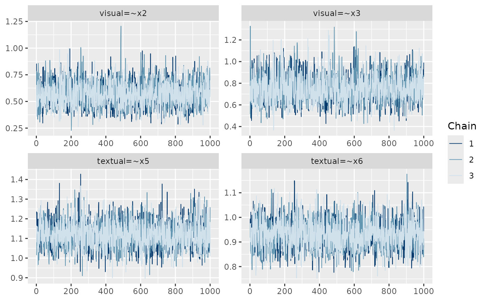
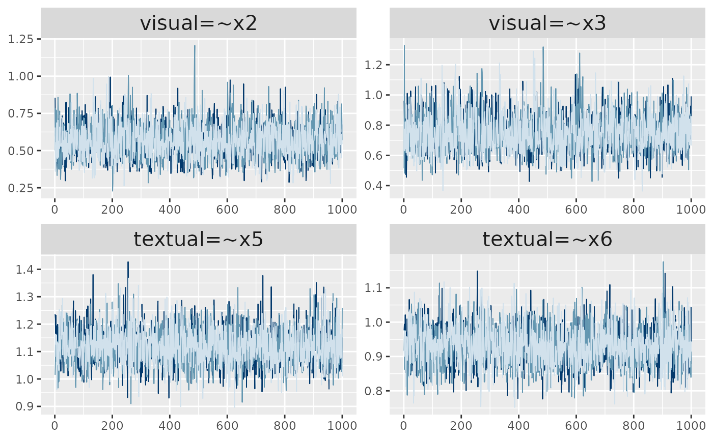

# Plot Functionality

A [`plot()`](https://rdrr.io/r/graphics/plot.default.html) method exists
for *blavaan* objects, with this method making use of the *bayesplot*
package (Gabry and Mahr 2021). We provide details here about how this
functionality works. We will use a 3-factor model for demonstration:

``` r
HS.model <- ' visual  =~ x1 + x2 + x3
              textual =~ x4 + x5 + x6
              speed   =~ x7 + x8 + x9 '
     
fit <- bcfa(HS.model, data=HolzingerSwineford1939)
```

### Basics

Because many *blavaan* models will have many parameters, users generally
need to specify which parameters they wish to plot. This is accomplished
by supplying numbers to the `pars` argument, where the numbers
correspond to the order of parameters from the
[`coef()`](https://rdrr.io/r/stats/coef.html) command (the numbers also
appear in the `free` column of the parameter table). Users must also
specify the type of plot that they desire via the `plot.type` argument.
So, for example, a trace plot of the first four model parameters looks
like

``` r
plot(fit, pars = 1:4, plot.type = "trace")
```



Many other plot types are available, coming from the *bayesplot*
package. In general, for *bayesplot* functions that begin with `mcmc_`,
the corresponding `plot.type` is the remainder of the function name
without the leading `mcmc_`. Examples of many of these plots can be
found in [this bayesplot
vignette](https://cran.r-project.org/web/packages/bayesplot/vignettes/plotting-mcmc-draws.html).

### Customization

Users may wish to customize some aspects of the resulting plots. For
this, the [`plot()`](https://rdrr.io/r/graphics/plot.default.html)
function will output a *ggplot* object. This makes it possible to modify
the plot as if it were any other *ggplot* object, which allows for many
possibilities. One starting point for exploring *ggplot2* is
[here](https://ggplot2.tidyverse.org/).

``` r
p <- plot(fit, pars = 1:4, plot.type = "trace", showplot = FALSE)

p + facet_text(size=15) + legend_none()
```



Alternatively, users may wish to create a plot that is entirely
different from what is available via
[`plot()`](https://rdrr.io/r/graphics/plot.default.html). This can be
facilitated by extracting the posterior samples or the Stan model, via
[`blavInspect()`](http://ecmerkle.github.io/blavaan/reference/blavInspect.md):

``` r
## list of draws
## (one list entry per chain):
draws <- blavInspect(fit, "mcmc")

## convert the list to a matrix
## (each row is a sample,
##  each column is a parameter)
draws <- do.call("rbind", draws)

## Stan (or JAGS) model
modobj <- blavInspect(fit, "mcobj")
```

### References

Gabry, Jonah, and Tristan Mahr. 2021. “Bayesplot: Plotting for Bayesian
Models.” <https://mc-stan.org/bayesplot/>.
