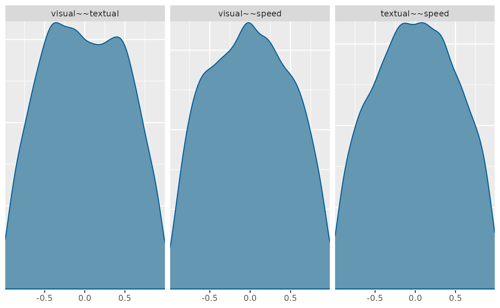

# Prior Predictive Checks

### Introduction

In Bayesian models we need to specify priors for the model parameters.
Priors are the distribution that we *think* the parameters would follow,
even before having data. These can represent **high** or **low**
uncertainty, so that a *diffuse* prior indicates that we don not know a
lot about how the parameter would behave, while an *informative* prior
means that we are quite certain about the expected distribution.

### Prior Predictive Checks

Prior predictive checks (PPC) generate data according to the prior in
order to asses whether a prior is appropriate (Gabry et al. 2019). A
posterior predictive check generates replicated data according to the
posterior predictive distribution. In contrast, the prior predictive
check generates data according to the prior predictive distribution
$y^{sim} \sim p(y)$.

The prior predictive distribution is just like the posterior predictive
distribution with no observed data, so that a prior predictive check is
nothing more than the limiting case of a posterior predictive check with
no data.

This is easy to carry out mechanically by simulating parameters
$\theta^{sim} \sim p(\theta)$ according to the priors, then simulating
data $y^{sim} \sim p\left( y \mid \theta^{sim} \right)$ according to the
sampling distribution given the simulated parameters. The result is a
simulation from the joint distribution,
$\left( y^{sim},\theta^{sim} \right) \sim p(y,\theta)$ and thus
$y^{sim} \sim p(y)$ is a simulation from the prior predictive
distribution.

In *blavaan* we can get PPC when we use the argument `prisamp=TRUE` ,
this will tell blavaan to ignore the data and build distributions only
from the priors. Here we will start by adjusting the priors, instead of
using the default priors.

#### Weakly informative priors

We will show an example with the Holzinger and Swineford (1939) data,
first a case with weakly informative priors. Here we are stpecifying
that the observeded variable intercepts will have a prior of $N(3,2)$,
the factor loadings will have a prior of $N(0.4,2)$, and the residual
standard deviation with a prior of $\Gamma(1,1)$.

``` r
priors <- dpriors(nu="normal(3,2)",
                  lambda="normal(0.4, 2)",
                  theta="gamma(1,1)[sd]")
```

Then we estimate the BSEM model with the respective priors on the `dp`
argument, and with `prisamp=TRUE`, so getting PPC instead of posterior
distributions.

``` r
HS.model <- ' visual  =~ x1 + x2 + x3
              textual =~ x4 + x5 + x6
              speed   =~ x7 + x8 + x9 '

fit_wi <- bcfa(HS.model, data=HolzingerSwineford1939, 
            std.lv=TRUE, meanstructure=T, test = "none",
            dp=priors, prisamp = T)
```

You might get some warning messages from either divergent and/or failed
convergence. For this we would ignore these messages as it is likely to
have issues for the evaluations of prior predictions.

We now have a **blavaan** object with prior predictive distributions, so
we can use any of the package functions to describe them, and see if the
parameters are within expected ranges. For example we can get the PPC
density distributions for the first 9 parameters (factor loadings in
this case). The basic
[`plot()`](https://rdrr.io/r/graphics/plot.default.html) method calls
the functions from the `bayesplot` package (Gabry and Mahr 2021) and
with the `plot.type = "dens"` argument we can plot the density
distributions

``` r
plot(fit_wi, pars=1:9, plot.type = "dens")
```


You can also pick which parameters to plot, like the factor correlations
by chossing parameters `19:21` in this case

``` r
plot(fit_wi, pars=19:21, plot.type = "dens")
```



From the factor loading distributions we see that the first loading on
each factor is bounded by 0, this is due to a modeling identification
constraint in blavaan, and with a maximum value around 6. And for all
other distributions they range between -6 to 6 or -4 to 4, and for all
priors the most likely value is around 0. This would be described as
weakly informative as it allows negative and positive values but without
allowing crazy high/low values.

What would be a *realistic* range would depend on the parameter, model
specification, and data. So, consider these priors in function of those
characteristics.

For the factor correlations we kept the default diffuse priors, so these
allowed very high and low correlation, but the prior distributions are
not flat across all possible correlation values.

#### Default priors

In this next example, we will estimate the PPC with the package default
priors, that would consider diffuse priors. You can see the blavaan
default priors with the function
[`dpriors()`](http://ecmerkle.github.io/blavaan/reference/dpriors.md)

``` r
dpriors()
```

    ##                nu             alpha            lambda              beta 
    ##    "normal(0,32)"    "normal(0,10)"    "normal(0,10)"    "normal(0,10)" 
    ##             theta               psi               rho             ibpsi 
    ## "gamma(1,.5)[sd]" "gamma(1,.5)[sd]"       "beta(1,1)" "wishart(3,iden)" 
    ##               tau 
    ##   "normal(0,1.5)"

Then we estimate the BSEM model and ignore the `dp` argument letting run
with the default priors, and with `prisamp=TRUE`, so getting PPC instead
of posterior distributions.

``` r
fit_df <- bcfa(HS.model, data=HolzingerSwineford1939, 
            std.lv=TRUE, meanstructure=T, test = "none", 
            prisamp = T)
```

Then we can plot the density distributions and compare them. We see that
with the default diffuse priors, the model allows up to very high values
such as -30 to 30

``` r
plot(fit_df, pars=1:9, plot.type = "dens")
```


This way we can see that the more diffuse priors allows a higher range
of values. It is up to the researcher to decide which range of priors
better present their expectations.

It is important to note that these PPC allows to see the expected
distributions based on the priors, but these might not be the same as
the priors used in the estimation process, as the priors interact with
the model specification and constraints (such as the o bound constraint
for the first factor loading) (Merkle et al. 2023)

### References

Gabry, Jonah, and Tristan Mahr. 2021. “Bayesplot: Plotting for Bayesian
Models.” <https://mc-stan.org/bayesplot/>.

Gabry, Jonah, Daniel Simpson, Aki Vehtari, Michael Betancourt, and
Andrew Gelman. 2019. “Visualization in Bayesian Workflow.” *Journal of
the Royal Statistical Society Series A: Statistics in Society* 182 (2):
389–402. <https://doi.org/10.1111/rssa.12378>.

Holzinger, K. J., and F. A. Swineford. 1939. *A Study of Factor
Analysis: The Stability of a Bi-Factor Solution*. Supplementary
Educational Monograph 48. Chicago: University of Chicago Press.

Merkle, Edgar C., Oludare Ariyo, Sonja D. Winter, and Mauricio
Garnier-Villarreal. 2023. “Opaque Prior Distributions in Bayesian Latent
Variable Models.” *Methodology* 19: 228–55.
<https://doi.org/10.5964/meth.11167>.
